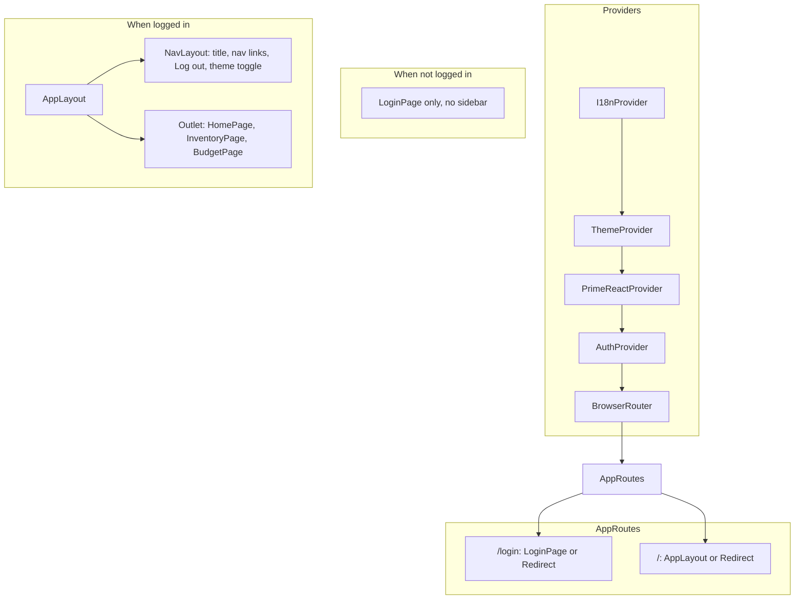
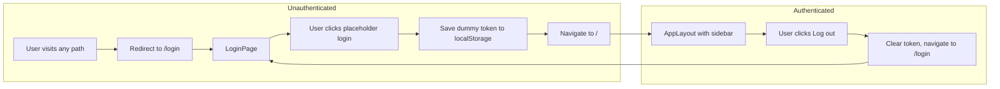

# App shell and auth flow

## Component tree (providers and routing)

## Auth flow

- **Token key:** `illo3d-token` (AuthContext).
- **Route protection:** No token → only `/login` renders LoginPage; all other paths redirect to `/login`. Token present → `/login` redirects to `/`; `/`, `/inventory`, `/budget` render AppLayout with Outlet.

## Translations (i18n)

- **I18nProvider** wraps the app; provides `t(key, params?)` via useI18n(). Locale files: `src/locales/en.json`, `es.json` (structure ready for Spanish; only EN filled for now).
- **User-facing strings:** All UI copy goes through `t('key')`. Key names: `app.title`, `nav.*`, `auth.*`, `home.*`, `inventory.*`, `budget.*`.
- **Configurable from data:** Currency, company name, markup, etc. come from database (e.g. company.currency) when loaded; do not use translation keys for those.

## UI stack

- **PrimeReact** (Lara theme, light/dark via ThemeContext). **PrimeReactProvider** wraps the app; theme CSS is loaded by `PrimeReactThemeLink` from ThemeProvider.
- **Atoms** (Button, Input, Checkbox) are thin wrappers over PrimeReact; Label unchanged. **TabsLayout** uses TabView (tab strip only). **Inventory tables** use DataTable on the page; TableLayout was removed.
